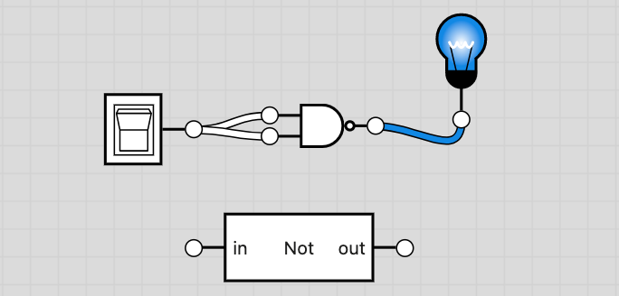
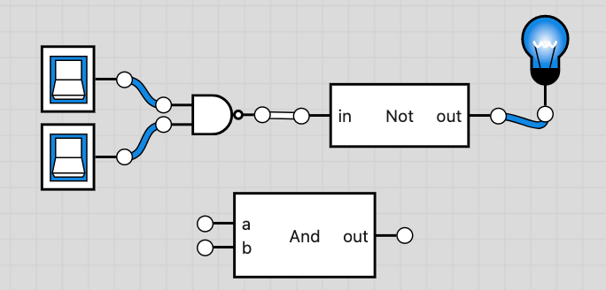
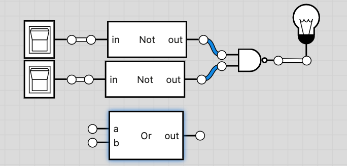
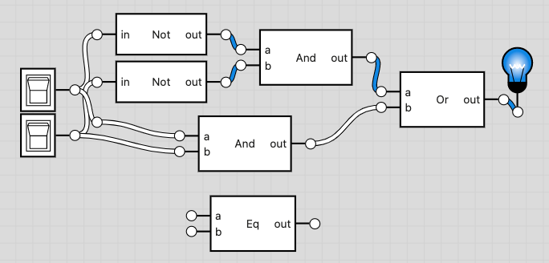
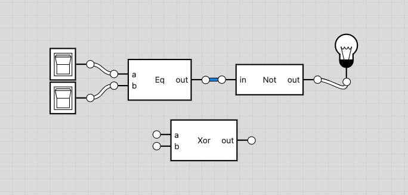
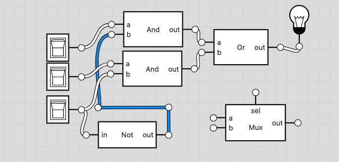
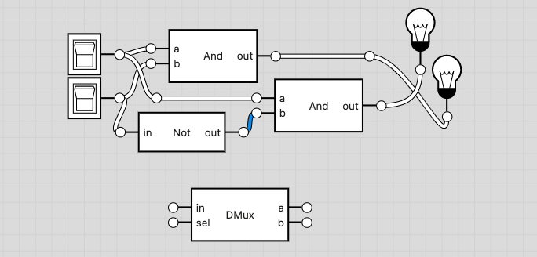

# 01

## Todo

- [x] And.hdl
- [ ] And16.hdl
- [x] DMux.hdl
- [ ] DMux4Way.hdl
- [ ] DMux8Way.hdl
- [x] Mux.hdl
- [ ] Mux4Way16.hdl
- [ ] Mux8Way16.hdl
- [ ] Mux16.hdl
- [x] Not.hdl
- [ ] Not16.hdl
- [x] Or.hdl
- [ ] Or8Way.hdl
- [ ] Or16.hdl
- [x] Eq.hdl (custom)
- [x] Xor.hdl

## Notes

## Not

Negates a given input. Thus, matches 1 to 0 and 0 to 1.

`!A`

### And

Determines whether two given inputs are both 1 or not.

`AB`

### Or

Determines whether any of two given inputs is 1.

`A + B`

### Eq

Yields 1 if both `a` and `b` are `0` or `1`. Thus, if a and b are equal.

`AB + !A!B`

Future notation: `==`

### Xor

Determines if the two given inputs are not equal

`!(A == B)`

### Mux

Output the value of `a` to `out` if `sel==0`; else in `b`

`out = (A if sel == 0 else B)`

### DMux

Display `in` in `a` if `sel==0`; else in `b`

`(A if sel == 0 else B) = in`
