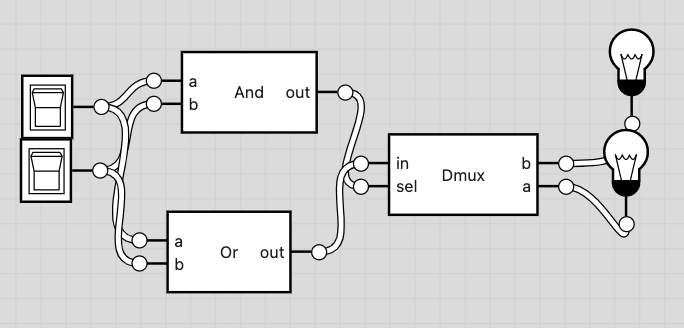
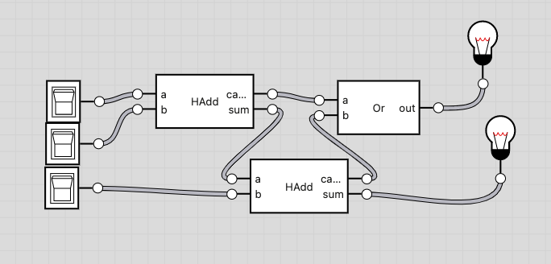
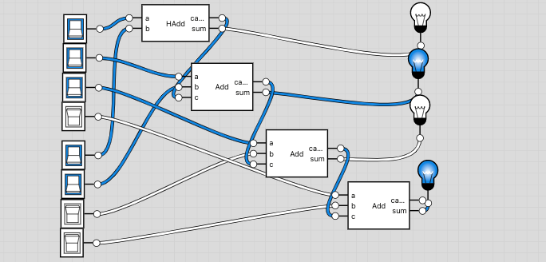

# 01

## Todo

- [x] Add16.hdl
- [ ] ALU.hdl
- [x] FullAdder.hdl
- [x] HalfAdder.hdl
- [x] Inc16.hdl

## Notes

### HalfAdder

### FullAdder

### Add16

The chip is just a concatenation of Full and Half Adders.
Something like...

